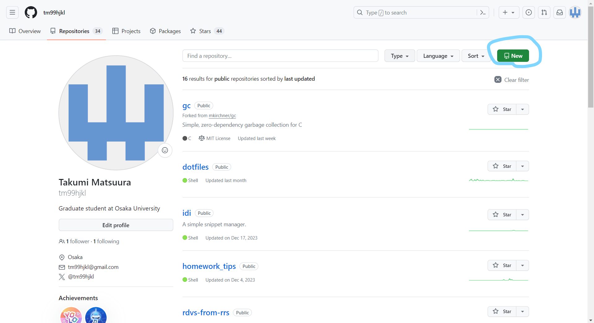
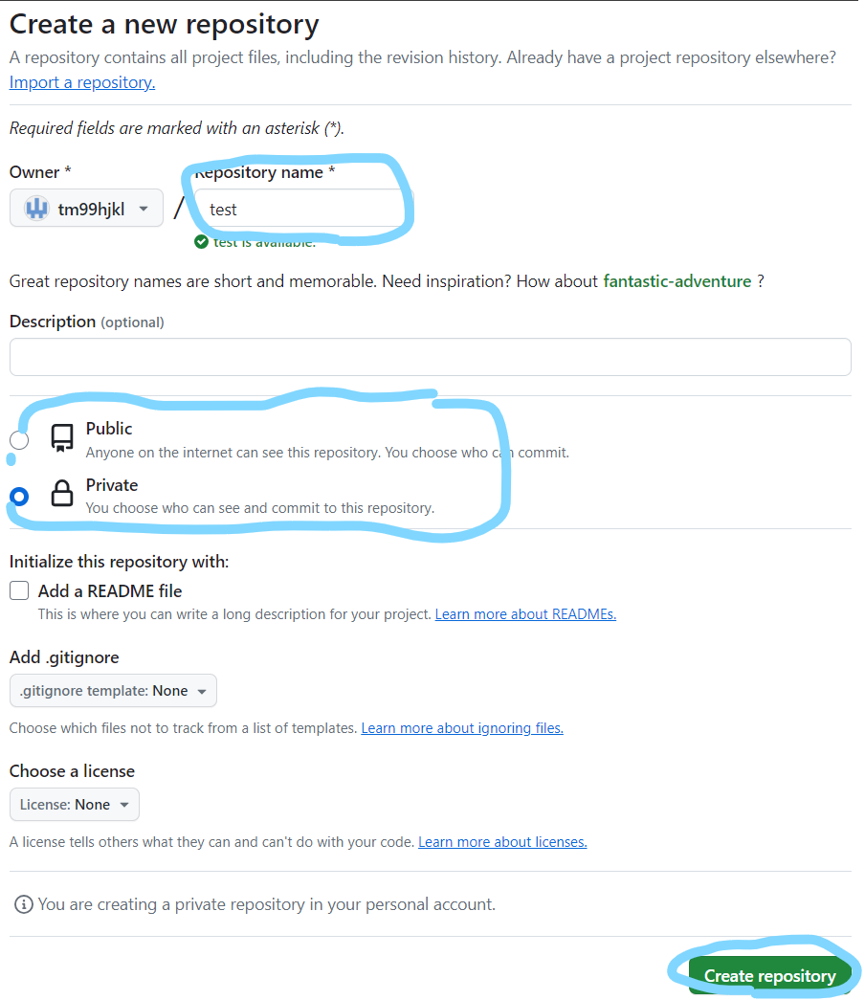
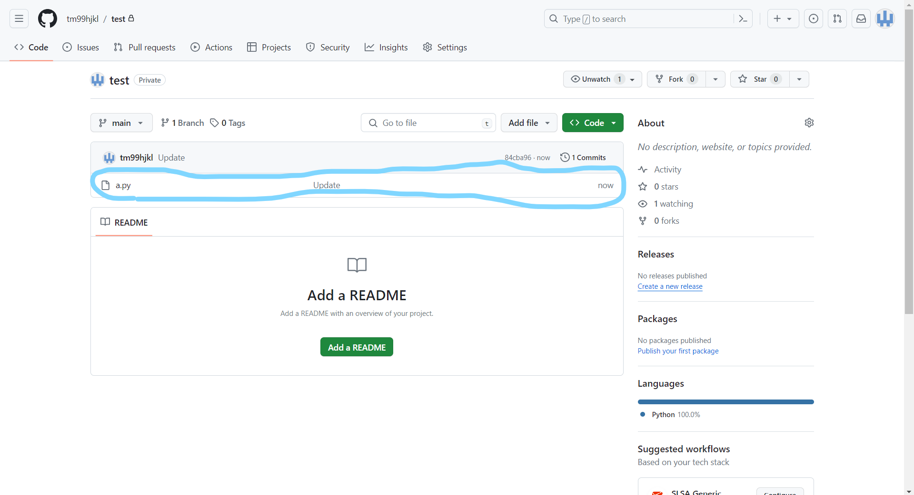
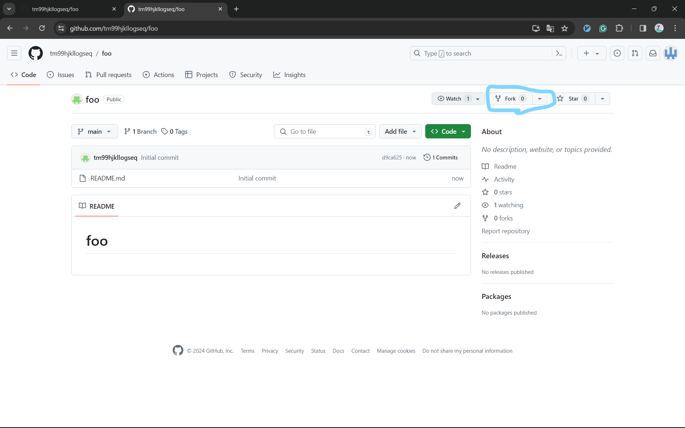
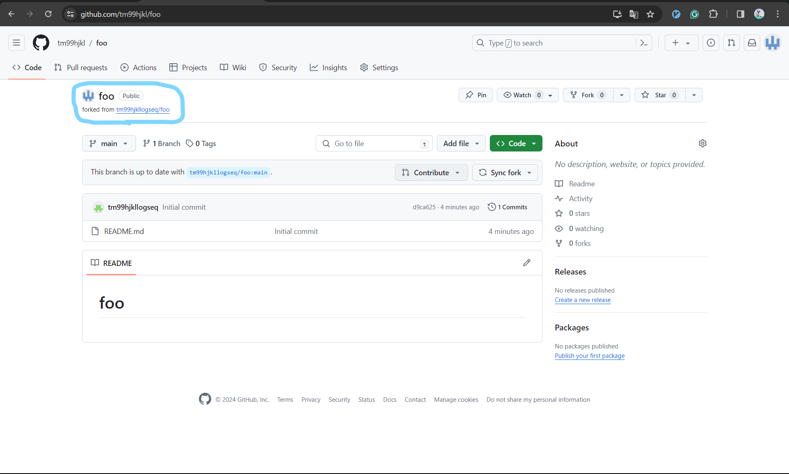
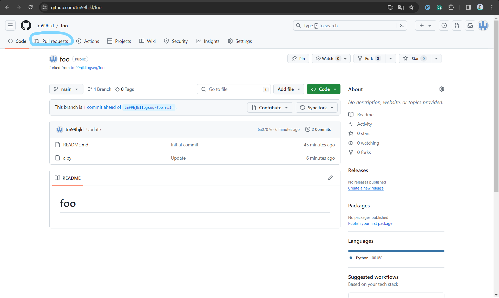
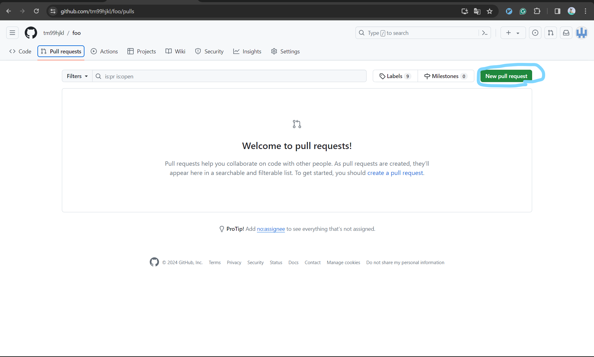
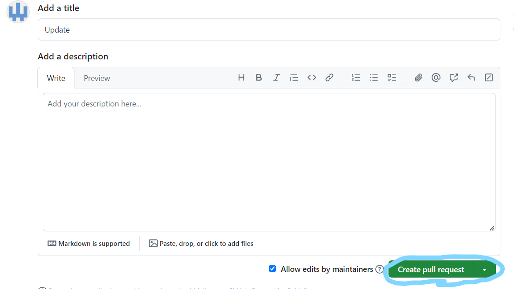

# Git/GitHubの使い方

Gitは有名なバージョン管理ツールです。
Gitを使うと、誰がいつどの行を（どういう意図で）更新したかなどを簡単に把握することができます。
おそらくあらゆる開発現場で使われているので、研究生活中に慣れておいて損はないと思います。

このドキュメントでは、GitとGitHubの初期設定を終えた人向けに、これらの基本的な使い方を説明します。また、ある程度Gitに慣れている人にも[おすすめのツール](#おすすめのツール)は役立つかもしれません。

## 目次

* [はじめてのpush](#はじめてのpush)
* [はじめてのPull request](#はじめてのPull-request)

# はじめてのPush

自分のPCでの作業内容をGitHubにアップロードすることを「Pushする」と言います。
これは、アップロードする際に `git push` というコマンドを使うからです。

とはいえ、作業しているディレクトリで単に `git push` とすれば済むわけではなく、いくつかのしなければいけない作業があります。

このセクションでは、ひとまず `git push` を実行するまでの簡単な手順を説明します。

## リポジトリの作成

まずはGitHubでリポジトリを作成します。
リポジトリというのは、PCのフォルダのようなものをイメージすればよいです。
つまりGitHubでリポジトリを作成するというのは、Google DriveやDropboxで新しいフォルダを作成するような行為を連想するとよいと思います。
最終的にはこの新たに作成したリポジトリに `git push` することになります。

リポジトリの作成には画像青丸部の "New" をクリックします：



次に、Repository nameと公開範囲を適当に設定し、 "Create repository" をクリックするとリポジトリの作成が完了します：



なおこのようにGitHub上で作ったリポジトリは、リモートリポジトリと呼ばれます。

## 自分のPCで作業内容をpushする

リモートリポジトリの作成を終えたら、そこに変更を加えます。
まずは先ほどのリモートリポジトリの内容を自分のPCにダウンロードします。
これには `git clone` というコマンドを用います。：

```sh
# `tm99hjkl` の部分はあなたの GitHub のアカウント名
# `test` の部分は先ほど作ったリポジトリ名
git clone git@github.com:tm99hjkl/test.git
```

なお、 `git clone` は自分が作成したリポジトリでなければダウンロードできないというわけではなく、GitHub上で公開されている任意のリポジトリをダウンロードすることができます。
ダウンロードする際には、そのリポジトリのURLを入力してやればよく、例えばこのドキュメントのリポジトリをダウンロードする場合は `git clone https://github.com/fseclab-osaka/tips_pub` を実行するだけです。

さて、次に、なにか新しいファイルを作り、適当に文字列を書き込んでみましょう。
（以下では簡単のために `echo` を使っていますが、普通はエディタを使います。）：

```sh
echo 'print("hello world")' > a.py
````

最後に、以下のコマンドを実行すれば、ひとまずpush完了です：

```sh
git add a.py
git commit -m "Update"
git push
```

リモートリポジトリを確認すると、無事 `a.py` がアップロードされていることが確認できます：



# はじめてのPull request

Pull requestは基本的には、リポジトリの管理者に、自分が行った変更を取り込んでほしいときに使います。
あるリポジトリに対して、「いい感じに {バグ修正, 機能追加, typofix, etc...} してみたから、これを正規のコードとして受け入れてくれない？」というリクエストを送る機能のことです。
Pull requestを作成すると専用の掲示板のようなものが出来上がり、自分が行った変更に関する議論の場が用意されます。
これにより複数人で同じコードを吟味でき、より良いコードを本番に反映することができるので、とても便利です。
この節ではPull requestを送る手順を書きます。

## リポジトリをforkする

上で述べたように、あるリポジトリにPull requestを送るには、そのリポジトリに影響しないよう、「自分専用のコピーを作って」変更をpushする必要があります。
このコピーの作成を「リポジトリをforkする」といいます。リポジトリをforkするには、そのリポジトリのページで"Fork"をクリックし、"Create fork"をクリックします：



forkが作成できると、以下のような画面になります（左上部に "forked from \<repo name\>" と書かれていると思います）：



## forkしたリポジトリに変更をpushする

では、forkしてきたリポジトリをcloneし、何か変更を加えてみましょう。
ここでは[はじめてのPush](#はじめてのPush)とまったく同じ内容の変更を追加します：

```sh
git clone https://github.com/tm99hjkl/foo
cd foo
echo 'print("hello world")' > a.py
git add a.py
git commit -m "Update"
git push
```

## Pull requestを作成する

では、Pull requestを作成してみましょう。
forkしたリポジトリのページを開き、"Pull requests"をクリックします：



次に"Create pull request"をクリックします：



適当にタイトルを追記し、"Create pull request"をクリックします：



以上です。

# おすすめのツール

以下では、 Git にまつわる作業をラクにしてくれるツールを紹介します。

## ghq

[ghq](https://github.com/x-motemen/ghq) を使うと、リモートからクローンしてきたリポジトリを一元管理することができます。
具体的には、今までなら「クローンしたいディレクトリを `mkdir` し、そこへ `cd` し、そして `git clone <repo>` ・・・」としていた手順を、 `ghq get <repo>` という1コマンドで完了させることができます。

例えば本リポジトリ (https://github.com/fseclab-osaka/tips_pub) に対し `ghq get` すると、 `$HOME/ghq/github.com/tips_pub` 下にクローンされます。
なお、 必ずしも github.com に存在するリポジトリである必要は無く、例えば gitlab.com にあるものでも git.savannah.gnu.org にあるものでも正常にクローンしてくれます。

インストール方法は以下です (go のバージョンは 2024/03/13 時点のもの)：

```sh
# install go (https://go.dev/doc/install)
curl -LO https://go.dev/dl/go1.22.1.linux-amd64.tar.gz
sudo rm -rf /usr/local/go && sudo tar -C /usr/local -xzf go1.22.1.linux-amd64.tar.gz
export PATH=$PATH:/usr/local/go/bin

# install ghq (https://github.com/x-motemen/ghq?tab=readme-ov-file#go-get)
go install github.com/x-motemen/ghq@latest
```

